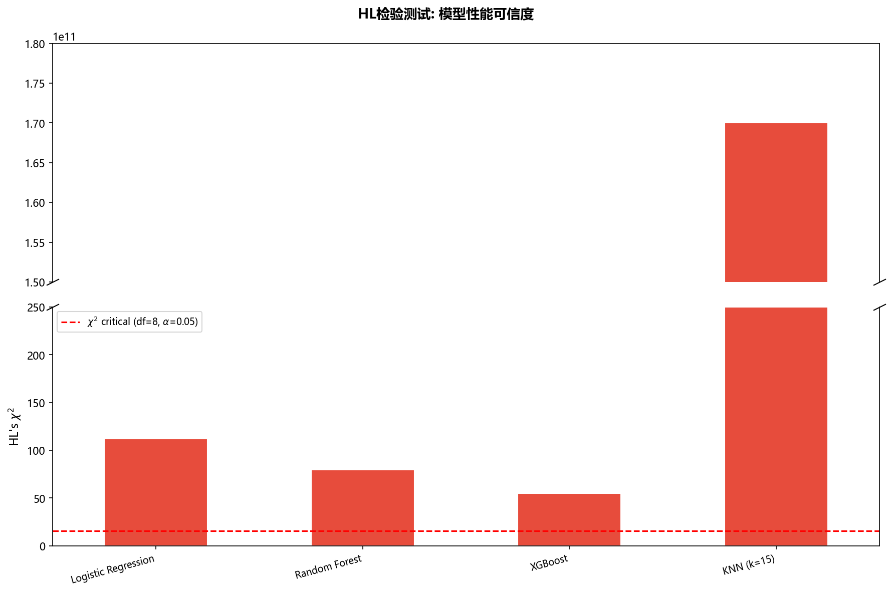
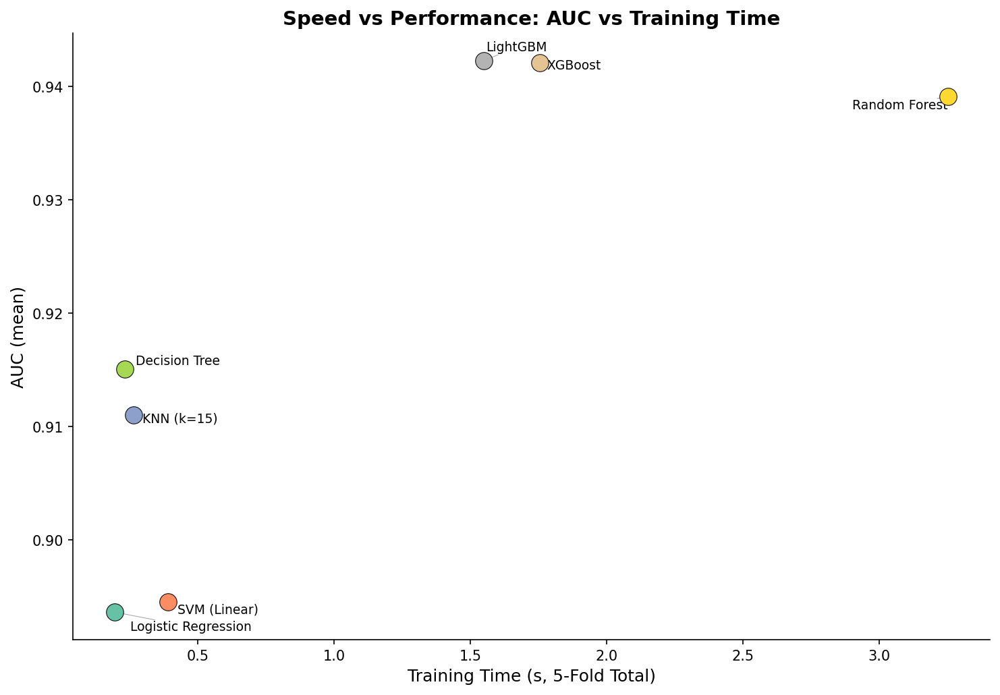

# 可视化心得分享 —— 原生断轴术与 adjustText 标签避让

## 一、 原生 Matplotlib 手搓“断轴柱状图”

### 问题背景
在评估模型校准性能（如 HL 检验）时，KNN 模型因预测概率离散，得出的卡方值会高达 `1.7e11`（1700亿），而逻辑回归等模型的卡方值仅在 `50~100` 之间。如果画在同一坐标系里，正常模型的柱子会被压成一条线。
*解决方案：采用原生 `plt.subplots(2, 1)` 实现物理断轴，完全不依赖第三方库。*

### 核心实现技巧
1. **`subplots` 物理隔离**：使用 `sharex=False` 创建上下两张独立的子图，并分别强制锁定 `ax1` 和 `ax2` 的 Y 轴区间。
2. **“截断底座”解决视觉断层**：利用 `ax2.get_ylim()[1]` 获取底部子图顶点，为冲破天际的柱子（KNN）在下方图顶端画一个同色底座，实现视觉贯通。
3. **隐藏腰部轴刻**：通过 `ax1.tick_params` 彻底清理顶部子图底部的刻度线和标签，防止断开处出现混乱的刻度重叠。
4. **`transAxes` 绝对居中画断口斜杠**：利用相对坐标变换，在断口处精准绘制居中且永不缩放的 `//` 符号。

### 1、核心代码实现（注意分辨代码中的变量名，所有前置代码可见./jupyter/calibration_dca.ipynb）
```python
# 数据引入
names_hl = list(hl_results.keys())
chi2s = [hl_results[n]['chi2'] for n in names_hl]
ps = [hl_results[n]['p'] for n in names_hl]

# 创建上下子图画布
fig, (ax1, ax2) = plt.subplots(2, 1, sharex=False, figsize=(12, 8))

#分别标注子图y轴数值
ax1.set_ylim(1.5e11, 1.8e11)
ax2.set_ylim(0, 250)

# 拼合上下子图
ax1.spines.bottom.set_visible(False)
ax2.spines.top.set_visible(False)
ax1.tick_params(axis='x', which='both', bottom=False, top=False, labelbottom=False)

x_start = -0.5
x_end = len(names_hl) - 0.5
ax1.set_xlim(x_start, x_end)
ax2.set_xlim(x_start, x_end)

x_pos = range(len(names_hl))

bottom_cap_height = ax2.get_ylim()[1] 

# 绘图
for i, (x, chi, p) in enumerate(zip(x_pos, chi2s, ps)):
    color = '#2ecc71' if p > 0.05 else '#e74c3c'
    if chi > 250: # 补全被隔断的柱子
        ax1.bar(x, chi, color=color, edgecolor='white', width=0.5)
        ax2.bar(x, bottom_cap_height, color=color, edgecolor='white', width=0.5)
    else:
        ax2.bar(x, chi, color=color, edgecolor='white', width=0.5)

ax2.axhline(y=15.507, color='red', linestyle='--', linewidth=1.5, label=r'$\chi^2$ critical (df=8, $\alpha$=0.05)')
ax1.axhline(y=15.507, color='red', linestyle='--', linewidth=1.5)

# 绘制隔断符
d = 0.5
kwargs = dict(marker=[(-1, -d), (1, d)], markersize=12, linestyle="none", color='k', mec='k', mew=1, clip_on=False)
ax1.plot([0, 1], [0, 0], transform=ax1.transAxes, **kwargs)
ax2.plot([0, 1], [1, 1], transform=ax2.transAxes, **kwargs)

# 补全标签与标题
ax2.set_xticks(range(len(names_hl)))
ax2.set_xticklabels(names_hl, rotation=15, ha='right', fontsize=9)

ax2.set_ylabel(r"HL's $\chi^2$", fontsize=11)
fig.suptitle('HL检验测试: 模型性能可信度', fontsize=13, fontweight='bold')
ax2.legend(fontsize=9, loc='upper left')

plt.tight_layout()
plt.savefig(os.path.join(IMG_DIR, "14c_hl_test_native_broken_axis.png"), dpi=150, bbox_inches='tight')
plt.show()
```
#### 1.1、核心代码解释

*第一步：物理底座与隔离*
```python
fig, (ax1, ax2) = plt.subplots(2, 1, sharex=False, figsize=(12, 8))
ax1.set_ylim(1.5e11, 1.8e11)
ax2.set_ylim(0, 250)
```


*第二步：视觉腰线清空（隐藏多余边框与刻度）*

```python
ax1.spines.bottom.set_visible(False)
ax2.spines.top.set_visible(False)
ax1.tick_params(axis='x', which='both', bottom=False, top=False, labelbottom=False)
```

**·spines.bottom.set_visible(False) 与 spines.top.set_visible(False)：spines 是图表的物理边框。这两行代码精准隐藏了上下图交界处的黑线，让两张图无缝贴合，形成“一张图断开了”的视觉假象。**

**·tick_params(axis='x', which='both', bottom=False, top=False, labelbottom=False)：**

  **·axis='x'：锁定只清理横轴。**
  
  **·which='both'：主刻度和次刻度全清，不留死角。**
  
  **·后面的三个 False：把顶部子图（ax1）底部所有的刻度线和标签数字全部“物理擦除”，确保断口处清爽，完全交由底部 ax2 负责。**


*第三步：核心骚操作——“穿天大柱”的视觉贯通*

```python
bottom_cap_height = ax2.get_ylim()[1]  # 获取底图最高点，即 250
if chi > 250:
    ax1.bar(x, chi, ...)                     # 在顶部画柱子
    ax2.bar(x, bottom_cap_height, ...)       # 在底部顶端画一个同色底座！
```

**· 为什么要加这个底座？ 如果 KNN 的柱子超过了 250，顶部图确实画出了红柱，但底部图的对应位置（y=250 处）会留下一个“悬空的黑洞”。在底图最高点强行补齐一根同色的“截断底座”，让红柱看起来像是从下往上破土而出，视觉上直接贯通，完美解决柱子“断根悬浮”的问题。**

**· 原理：通过 ax2.get_ylim()[1] 动态获取底图最大值，保证无论 Y 轴怎么调，底座永远精准对齐在顶端。**


*第四步：绝对对齐——用 transAxes 画断口斜杠*

```python
d = 0.5
kwargs = dict(marker=[(-1, -d), (1, d)], markersize=12, linestyle="none", color='k', ...)
ax1.plot([0, 1], [0, 0], transform=ax1.transAxes, **kwargs)
ax2.plot([0, 1], [1, 1], transform=ax2.transAxes, **kwargs)
```

**· transform=ax1.transAxes：这是 Matplotlib 里最优雅的“绝对坐标系”用法。它定义 (0,0) 始终为画布左下角，(1,1) 始终为右上角。无论图表怎么缩放，断轴斜杠永远居中。**

**· marker=[(-1, -d), (1, d)]：用数学方式（两点连线）形成倾斜的 // 符号。千万不能用 ax.text 手写 //，那样的斜杠会随着图表缩放而位移，非常不专业。**

**· plt.subplots(2, 1, sharex=False)：创建一个 2 行 1 列的画布。sharex=False 是地基中的地基！ 它强制让上方和下方的坐标轴完全独立，防止顶部巨大的 1.7e11 把底部 0~250 的刻度也同步拉大。**

**· ax1.set_ylim(...) 与 ax2.set_ylim(...)：用 set_ylim 物理锁死 Y 轴范围。ax1 专门用于承载 KNN 爆表的卡方值，ax2 专门用于展示正常模型的微小卡方值。这种物理隔离，是断轴图安全可靠的前提。**


### 图片展示




## 二、 adjustText 原理与散点图标签避让实战(注意分辨代码中的变量名，所有前置代码可见./jupyter/teacher.modeling_comparison.ipynb)

### 问题背景
在画多模型性能对比散点图（比如耗时 vs AUC）时，多个模型名称点密集堆叠在一起，文字直接“糊”成一团。
*解决方案：引入 adjustText 的“力导向算法”，实现标签的物理自动避让。*

### 核心实现技巧
adjustText 底层不是简单的穷举，而是‘力导向布局算法’。你可以把每个标签想象成带电粒子：它们自带‘排斥力’防止彼此重叠；但底部又有‘锚定拉力’，防止飞太远脱离原点。通过几十次迭代，系统会自动计算出一个‘既不打架，又离得近’的全局最优解。这正是 AI 解决排版问题的方式。

### 核心代码实现
```python
from adjustText import adjust_text

fig, ax = plt.subplots(figsize=(10, 7))

# 创建一个空列表，用来存放生成的文字对象
texts = []

for r in all_results:
    # 画散点（保持你原本的样式：颜色、边缘黑线、高优先级 zorder）
    ax.scatter(r['time_total'], r['auc_mean'], 
               s=150, 
               c=colors_polar[names.index(r['name'])], 
               edgecolors='black', 
               linewidths=0.5, 
               zorder=5)

    # 核心改动：用 ax.text 生成文字，但不要指定偏移量，先让它呆在点的正上方
    t = ax.text(r['time_total'], r['auc_mean'], r['name'], 
                fontsize=9, 
                ha='left', 
                va='center')
    texts.append(t)  # 把文字对象存进列表

# 自动计算最合适的位置把文字推开，并画一条细灰线指回原点
adjust_text(
    texts, 
    force_text=0.02,
    only_move={'text': 'y', 'points': 'y'},  # 限制只在 Y 轴（上下）移动，防止 X 轴错乱
    arrowprops=dict(arrowstyle='-', color='gray', lw=0.5, alpha=0.7) ,
    avoid_self=True
)
# ===========================

# 设置坐标轴与标题
ax.set_xlabel('Training Time (s, 5-Fold Total)', fontsize=12)
ax.set_ylabel('AUC (mean)', fontsize=12)
ax.set_title('Speed vs Performance: AUC vs Training Time', fontsize=14, fontweight='bold')
ax.spines['top'].set_visible(False)
ax.spines['right'].set_visible(False)

plt.tight_layout()
plt.savefig(os.path.join(IMG_DIR, "12c_speed_vs_performance.png"), dpi=150, bbox_inches='tight')
print("[图] 12c_changed_speed_vs_performance.png")
plt.show()
```

####

#### 图片展示


